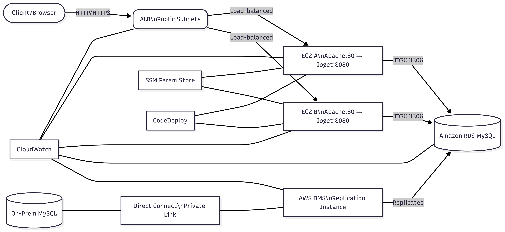
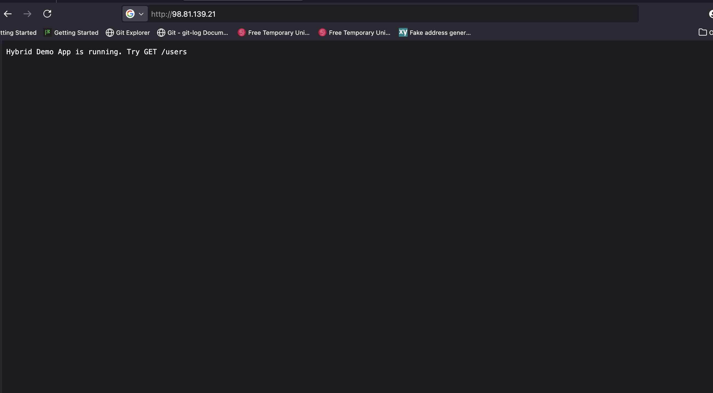
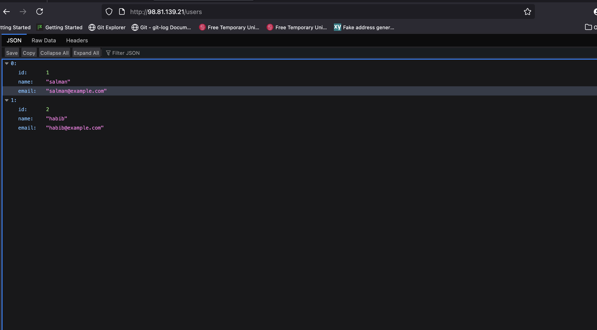

# Hybrid-cloud-infrastructure

Hybrid Cloud Infrastructure running Joget Application across On‑Prem and AWS with automated CI/CD, secure private connectivity (AWS Direct Connect), DMS for database migration, and operational monitoring.

This solution includes:
- AWS (us-west-1): VPC with public/private subnets, NAT, ALB, Auto Scaling (2 EC2 app instances), IAM, Security Groups, NACLs, CloudWatch, CodeDeploy, S3 artifacts.
- On‑Prem (simulated in us-east-1): Single EC2 acting as on‑prem server running Apache + Joget + local MySQL.
- Database layer: Amazon RDS for MySQL (provisioned via AWS CDK) with DMS replication from on‑prem MySQL over Direct Connect.
- CI/CD: GitHub Actions builds and deploys the app to the EC2 Auto Scaling Group via AWS CodeDeploy.
- Configuration management: Secrets in SSM Parameter Store; instances read DB settings at deploy time.

Architecture diagram (image):
- diagrams/Hybrid Cloud joget Diagram.png

Architecture diagram (Mermaid):

Screenshots On Prem
- App: 
- Users: 

---

## How it works in cloud and On-Prem (end-to-end flow)

- Client → ALB: Internet users access the ALB (HTTP/HTTPS).
- ALB → EC2: Requests are distributed to two EC2 instances in private subnets (Auto Scaling Group).
- On each EC2: Apache listens on port 80 and reverse-proxies to Joget running on 127.0.0.1:8080.
- App → DB: Joget connects to MySQL via JDBC using SSM-provided settings. Target can be on‑prem (initial) or RDS (after DMS c2c).
- On‑Prem → RDS: AWS DMS replicates data from on‑prem MySQL to RDS over Direct Connect (private link). After validation, switch the app to RDS by updating SSM parameters; no code changes required.
- CI/CD: GitHub Actions builds the JAR, packages deployment artifacts, uploads to S3, and triggers CodeDeploy to rollout on EC2s with health checks via ALB.
- Observability: CloudWatch metrics/alarms for ALB, EC2/ASG, RDS, and DMS; instance/application logs can be shipped via CloudWatch Agent.

---

## Prerequisites

- Terraform >= 1.6
- AWS CLI authenticated to your AWS account
- GitHub repository (this repo) with Actions secrets configured
- SSM Parameter Store entries for DB configuration (no secrets in code)
- Optional: python + pip and AWS CDK CLI for RDS/DMS stacks

SSM parameters (us-west-1):
- /hybrid-cloud-joget/db_url
- /hybrid-cloud-joget/db_user
- /hybrid-cloud-joget/db_password

---

## On‑Premise Simulation (us-east-1)

Simulates an on‑prem server on a separate EC2 and you can have a Dedicated Server, running Apache + Joget + local MySQL.

Steps:
- Provision an EC2 in us-east-1 (Ubuntu/Debian).
- SSH to the server.
- Open scripts/onprem_setup.sh from this repo and copy its contents on the server:
  - vim onprem_setup.sh
  - Paste the script content; save and exit (:wq!)
- Export your GitHub token if pulling private code:
  - export GITHUB_PAT="ghp_xxx"
- Run the installer:
  - sudo -E bash onprem_setup.sh
- Access: http://YOUR_ONPREM_PUBLIC_IP:80

What the onprem_setup.sh script does (summary):
- Installs Java/Maven/Git/Apache
- Fetches app/config, builds the JAR
- Creates a systemd service for Joget (port 8080, loopback)
- Configures Apache reverse proxy from :80 → 127.0.0.1:8080
- Starts services and enables on boot

---

## Deploy: Cloud Infrastructure (Terraform, us-west-1)

- cd infrastructure
- terraform init
- terraform plan -var="project_name=hybrid-cloud-joget" -var="admin_ip=YOUR_PUBLIC_IP/32"
- terraform apply -var="project_name=hybrid-cloud-joget" -var="admin_ip=YOUR_PUBLIC_IP/32"

After apply, note outputs:
- alb_dns_name
- artifact_bucket (S3 for CI/CD artifacts)

---

## RDS for MySQL (AWS CDK, CloudFormation)

RDS is provisioned separately via AWS CDK Python code:
- cd rds-cluster-instance
- Update settings.py (engine/version, instance class, subnets/SGs, DB name/credentials)
- Follow rds-cluster-instance/README.md to install dependencies
- cdk synth
- cdk bootstrap
- cdk deploy

Recommended: Multi‑AZ, GP3, encryption (KMS), private subnets, SG allowing 3306 from App SG (and DMS SG during migration).

---

## Direct Connect + DMS (Hybrid Connectivity & Migration)

Use Direct Connect for private connectivity and AWS DMS to migrate from on‑prem MySQL to RDS.

- Detailed steps are in docs/direct-connect-dms.md
- High-level plan:
  1) Ensure non‑overlapping CIDRs (e.g., VPC 10.0.0.0/16; On‑Prem 10.1.0.0/16).
  2) Create Direct Connect, DX Gateway (DXGW), Private VIF; create VGW and attach to VPC; associate DXGW↔VGW.
  3) Enable route propagation on private route tables; configure BGP on on‑prem router to advertise on‑prem prefixes.
  4) DMS in private subnets; endpoints: source = on‑prem MySQL over DX, target = RDS; task: Full load + CDC.
  5) Cutover by updating /hybrid-cloud-joget/db_url SSM parameter to the RDS endpoint; redeploy via CI/CD.

Lab alternative: Use Site‑to‑Site VPN if DX is unavailable.

---

## Configure SSM Parameters (us-west-1)

You can do this Once you have created the RDS MYSQL in AWS us-west-1.

Create these in Parameter Store (type SecureString recommended):
- /hybrid-cloud-joget/db_url = jdbc:mysql://YOUR_RDS_OR_ONPREM:3306/joget_db
- /hybrid-cloud-joget/db_user = jogetuser
- /hybrid-cloud-joget/db_password = StrongPassword123!

Instances read these at deploy time to configure database connectivity.

---

## CI/CD Setup (GitHub Actions + CodeDeploy)

In GitHub repo Settings → Secrets and variables → Actions, add:
- AWS_ACCESS_KEY_ID
- AWS_SECRET_ACCESS_KEY
- AWS_REGION = us-west-1
- ARTIFACT_BUCKET = (exact terraform output artifact_bucket)
- CD_APP_NAME = hybrid-cloud-joget-codedeploy-app
- CD_DEPLOYMENT_GROUP = hybrid-cloud-joget-codedeploy-dg

Workflow (on push to main):
- Build Java app (joget_app) with Maven
- Package JAR + appspec.yml + scripts
- Upload artifact to S3 artifact bucket
- Trigger AWS CodeDeploy in-place deployment to both EC2 instances
- ALB health checks ensure safe rollout

Open the app:
- Health: http://ALB_DNS_NAME/health
- App:    http://ALB_DNS_NAME/app

---

## Security Groups & Network ACLs

Security Groups (stateful):
- ALB-SG
  - Inbound: 80/443 from 0.0.0.0/0
  - Outbound: all
- APP-SG (EC2 instances)
  - Inbound: 80 from ALB-SG only
  - Outbound: all
- RDS-SG
  - Inbound: 3306 from APP-SG (and from DMS SG during migration)
  - Outbound: default
- DMS-SG
  - Outbound: 3306 to on‑prem MySQL and to RDS
  - Inbound: typically none (DMS initiates)

Network ACLs (stateless):
- Public NACL (public subnets)
  - Inbound allow: 80, 443, 1024–65535 from 0.0.0.0/0
  - Outbound allow: all
- Private NACL (private subnets)
  - Inbound allow: 80 from VPC CIDR (ALB→EC2), 1024–65535 from 0.0.0.0/0 (ephemeral returns)
  - Outbound allow: all

---

## Backup & DR Strategy

RDS (MySQL):
- Automated backups with retention, PITR enabled
- Multi‑AZ for high availability
- Regular snapshots before major changes; optional cross‑region snapshot copy for DR
- Parameterized backups/maintenance windows

On‑Prem (simulator) and EC2 app tier:
- AMIs before major app changes
- Application data stored in RDS; instance layer is stateless
- Optional: nightly logical backups (mysqldump) from on‑prem to S3; lifecycle policies for retention

DMS & Cutover:
- Use Full load + CDC; perform cutover during maintenance window
- Validate replication lag and integrity before switching app to RDS

---

## Monitoring & Alerting Strategy

CloudWatch Alarms (examples):
- ALB: HTTPCode_ELB_5XX_Count, TargetResponseTime, UnHealthyHostCount > 0
- ASG/EC2: CPUUtilization > 80%, StatusCheckFailed > 0
- RDS: CPUUtilization, FreeStorageSpace, DatabaseConnections
- DMS: CDCLatencySource/CDCLatencyTarget thresholds

Logging:
- Enable ALB access logs to S3 (optional)
- Install CloudWatch Agent on EC2 to ship Apache/access/error logs and app logs
- DMS task logging to CloudWatch Logs
- CodeDeploy deployment logs for rollout visibility

Dashboards:
- Create a CloudWatch Dashboard covering ALB, ASG, RDS, and DMS KPIs

---

## Deployment & Teardown

Deploy (Cloud):
- cd infrastructure
- terraform init
- terraform plan -var="project_name=hybrid-cloud-joget" -var="admin_ip=YOUR_PUBLIC_IP/32"
- terraform apply -var="project_name=hybrid-cloud-joget" -var="admin_ip=YOUR_PUBLIC_IP/32"

Deploy (RDS via CDK):
- cd rds-cluster-instance
- cdk synth && cdk bootstrap && cdk deploy

Deploy (DMS via CDK):
- cd database-migration-service/dms-replication-instance
- cdk synth && cdk bootstrap && cdk deploy
- cd database-migration-service/dms-replication-task
- cdk synth && cdk bootstrap && cdk deploy

Teardown order:
1) On‑Prem simulator: Stop services and remove resources manually on the on‑prem EC2
2) DMS/CDK stacks: cdk destroy (replication task, endpoints, instance) and destroy RDS if desired
3) Cloud (Terraform): cd infrastructure && terraform destroy

---

## Change & Configuration Management Approach

- Infrastructure as Code
  - Terraform modules for VPC, security, ALB, ASG/EC2, IAM, monitoring
  - AWS CDK (Python) for RDS and DMS stacks
- CI/CD
  - GitHub Actions builds and packages artifacts; CodeDeploy orchestrates safe, rolling in‑place deployments behind ALB health checks
- Secrets and Config
  - SSM Parameter Store for DB settings; instances fetch at deploy time
  - No plaintext secrets in Terraform or user-data
- Environments
  - Project name and variables parameterize stack naming and tags

---

## Justifications & Trade-offs

- ALB + ASG + private subnets: Standard, secure, scalable pattern
- Apache proxy on instances: Simplifies app binding to loopback, allows request routing/logging; alternative is to target the app directly on 8080
- One NAT per AZ: Higher cost than single NAT, but resilient to AZ failures
- RDS via CDK: Keeps DB lifecycle separate; safer change domain; Terraform remains focused on network/compute
- Direct Connect + DMS: Private, reliable migration path; more setup than VPN but better performance and consistency

---

## Assumptions

- Non‑overlapping CIDRs between on‑prem (e.g., 10.1.0.0/16) and cloud (e.g., 10.0.0.0/16)
- Health endpoint /health returns HTTP 200
- GitHub Actions has permissions to the target AWS account
- On‑prem firewall allows DMS → MySQL:3306 during migration
- Domain/ACM certificates optional; HTTP acceptable for demo, HTTPS for production

---

## Challenges & Solutions

- ALB Health Checks initially Unhealthy:
  - Ensure Apache proxy and app service start before health check; use ASG health check grace period
- Package installs from private subnets:
  - NAT gateway per AZ; consider VPC endpoints for SSM/Logs to reduce NAT dependency
- DMS CDC issues:
  - Enable MySQL binlog (ROW), grant minimal replication privileges, verify BGP/route propagation over DX
- Secrets handling:
  - Store in SSM; grant least‑privilege IAM to instance role

---

## Future Improvements

- HTTPS with ACM + HTTP→HTTPS redirect; add AWS WAF on ALB
- Blue/Green deployments with two Target Groups and CodeDeploy traffic shifting
- VPC Interface Endpoints (SSM/Logs/EC2Messages) to reduce NAT usage
- CloudWatch synthetic canaries for user flows
- Cross‑region RDS snapshot copy for DR and disaster recovery runbooks
- Route 53 + custom domain for friendly URLs

---

## Docs

- docs/QUICKSTART.md – Quick steps for infra + pipeline
- docs/direct-connect-dms.md – Direct Connect + DMS guide

Security notes:
- No app secrets in Terraform or user data
- Instance role limited to ssm:GetParameter on /hybrid-cloud-joget/*
- ALB SG allows 80/443 from Internet; App SG allows 80 only from ALB SG; private subnets have no public ingress
- Use ACM + HTTPS on ALB for production

Note: Please follow steps in order to avoid mistakes.