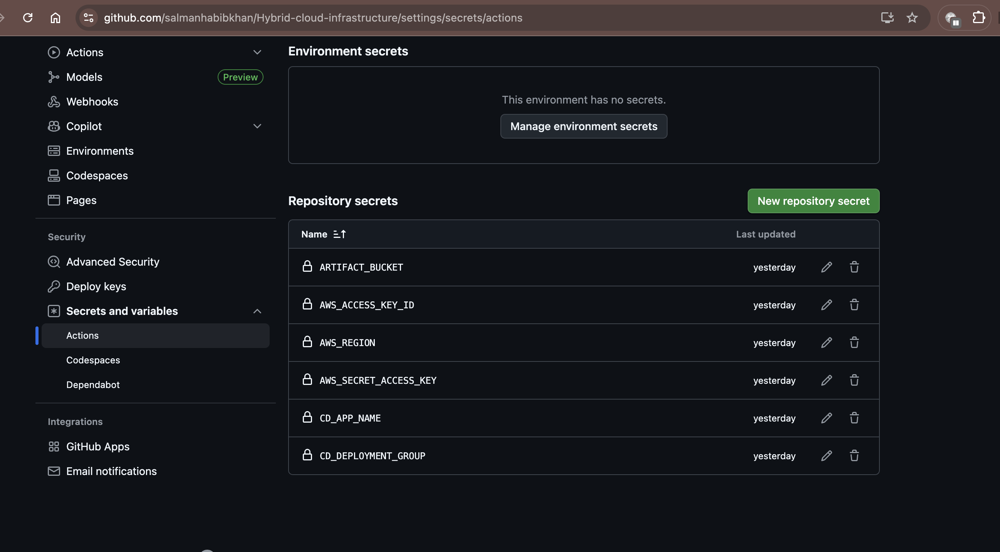

# Hybrid-cloud-infrastructure

This is a Hybrid Cloud Infrastructure which is setup on On-Prem & AWS

Joget App Deployment & DMS, AWS Direct Connet, AWS RDS Setup

------------

# Hybrid Cloud: Infra with Terraform + AWS CDK CloudFormation + CI/CD via GitHub Actions and CodeDeploy

This repo provisions cloud infrastructure in us-west-1 and a simulated on-prem server/EC2 in us-east-1 using Terraform. Application deployment is handled by a CI/CD pipeline (GitHub Actions) that builds your Java app and deploys it to two EC2 instances via AWS CodeDeploy.

Key points:
- Cloud (us-west-1): VPC, 2 public + 2 private subnets, NAT, ALB, 2 EC2 app servers (via ASG), Security Groups, NACLs, IAM, S3 artifacts, CodeDeploy, CloudWatch alarms.
- On-Prem (us-east-1): VPC + single server/EC2 for simulation (no automation).
- Pipeline: GitHub Actions builds from this repo, uploads artifact to S3, triggers CodeDeploy to deploy to the two EC2 instances.
- RDS and DMS are NOT in Terraform its done with the AWS CDK CloudFormation. But i recommend Direct Connect + DMS should done manually, but you can try DMS with infrastrcuture as well, steps are in docs/direct-connect-dms.md.

Architecture diagram: diagrams/Hybrid Cloud joget Diagram.png.

Prerequisites:
- Terraform >= 1.6
- AWS CLI
- AWS account and credentials (Administrator for initial setup)
- GitHub repo (this repo) with secrets configured (see CI/CD Setup below)
- SSM Parameter Store entries for DB config (so no secrets in code):
  - /hybrid-cloud-joget/db_url
  - /hybrid-cloud-joget/db_user
  - /hybrid-cloud-joget/db_password

Deploy (On-Prem simulator):
-  On‑prem/EC2 one-shot installer (Ubuntu/Debian)
-  Connect with the server
-  Run Vim onprem_setup.sh
-  Go into the Repositry on Github Hybrid-cloud-infrastructure/scripts/onprem_setup.sh
-  Copy All the Script and entered in the vim onprem_setup.sh
-  Save and exit from vim :wq!
-  Run: export GITHUB_PAT="ghp_xxx" 
-  sudo -E bash install_setup.sh
-  You can access your application via your your-server-public-ip:80

-  for app

-  for Users

AWS Direct Connect Configruation for  On-prem server & cloud connectivity with priavte Link (AWS Direct Connect):

- Deatils to Create the Connection is mentioned in the docs/direct-connect-dms.md

RDS Database Mysql:
- You can create it manually or with AWS CDK Python code with cloudformation.
- Go into the Hybrid-cloud-infrastructure/rds-cluster-instance
- Fill all the variables in setting.py which is necessary to run infra.
- You can Read the README.md file in rds-cluster-instance to install dependencies, which is necessary to run Infra.
- After Installing dependdencies. please Run the below cmds.
- cdk synth
- cdk bootstrap
- cdk deploy

Database Migration Service:
- Deatils to Create and implement infra of DMS is mentioned in the docs/direct-connect-dms.md

Deploy Cloud infrastrcture:
- cd infrastructure
- terraform init
- terraform plan -var="project_name=hybrid-cloud-joget" -var="admin_ip=YOUR_PUBLIC_IP/32"
- terraform apply -var="project_name=hybrid-cloud-joget" -var="admin_ip=YOUR_PUBLIC_IP/32"
- After apply, note output alb_dns_name & S3 Bucket

CI/CD Setup:
1) Create SSM Parameters in us-west-1 (SecureString recommended):
   - Name: /hybrid-cloud-joget/db_url      Value: jdbc:mysql://YOUR_RDS_OR_ONPREM:3306/joget_db
   - Name: /hybrid-cloud-joget/db_user     Value: jogetuser
   - Name: /hybrid-cloud-joget/db_password Value: StrongPassword123!
2) In GitHub repo settings > Secrets and variables > Actions, add:
   - AWS_ACCESS_KEY_ID
   - AWS_SECRET_ACCESS_KEY
   - AWS_REGION = us-west-1
   - CD_APP_NAME = hybrid-cloud-joget-codedeploy-app
   - CD_DEPLOYMENT_GROUP = hybrid-cloud-joget-codedeploy-dg
   - ARTIFACT_BUCKET = copy terraform output artifact_bucket name and add into github secrets, Like below Image.
   
3) Push to main (or open a PR and merge). The workflow:
   - Builds the Java app (joget_app) with Maven
   - Packages appspec.yml + scripts + built JAR
   - Uploads artifact zip to S3 and unzip
   - Triggers a CodeDeploy in-place deployment to the two EC2 instances
   - Go to AWS console and Codedeploy service and check the Deployment completed.

Open the app:
- Health: http://ALB_DNS_NAME/health
- App (proxied): http://ALB_DNS_NAME/app

Teardown:
- Destroy on-prem first: Delete All the things on On-prem-server/ec2
- Then cloud: cd infrastructure && terraform destroy

Docs:
- docs/QUICKSTART.md: Beginner steps for infra + pipeline
- docs/direct-connect-dms.md: Direct Connect + DMS guide

Security:
- No app secrets in Terraform or user data
- Instance role can read only /hybrid-cloud-joget/* SSM parameters (least privilege)
- ALB SG allows 80 from Internet; App SG allows 80 only from ALB SG; Private subnets have no public ingress
- Use ACM + HTTPS on ALB for production

Note:

Please Apply All the Steps One by One to avoid any Mistak.
